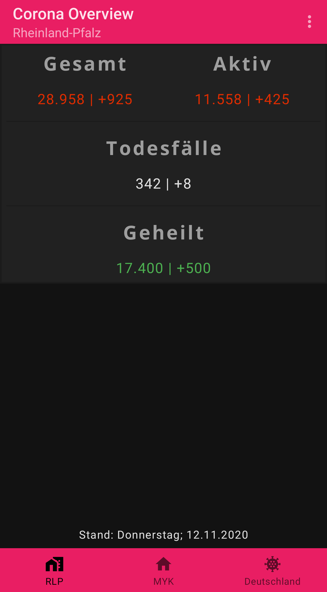
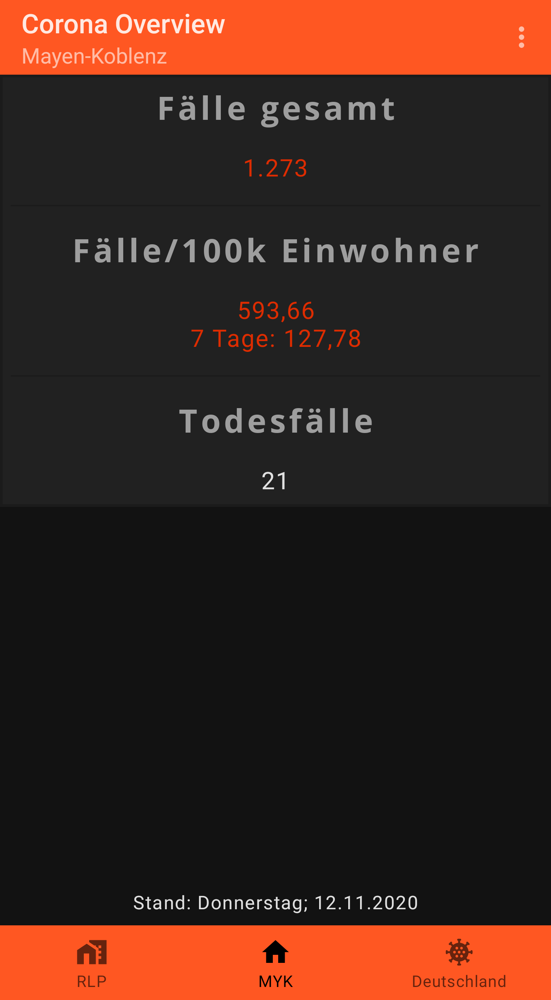
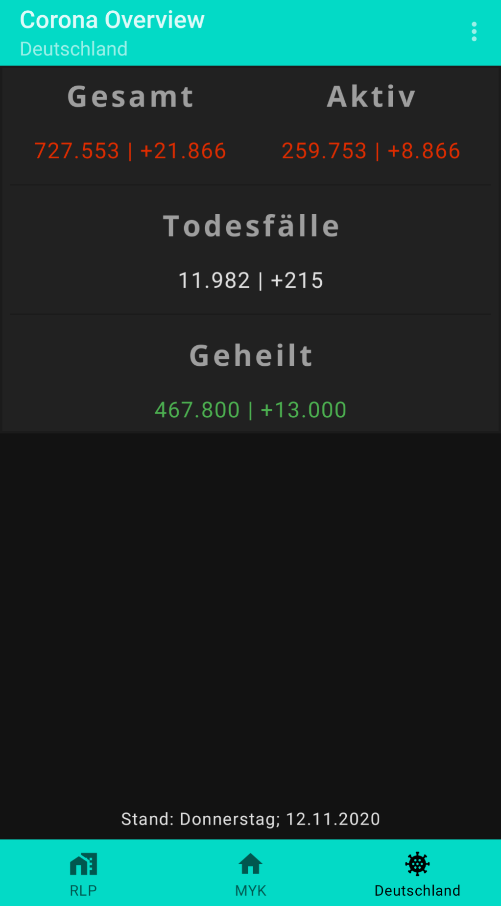

# Screenshots
## Normal/Light Theme
**RLP-Section**
 
**MYK-Section**
 
**Deutschland-Section**

## Dark Theme (changes with device-configured theme)
**RLP-Section**
 
**MYK-Section**
 
**Deutschland-Section**

